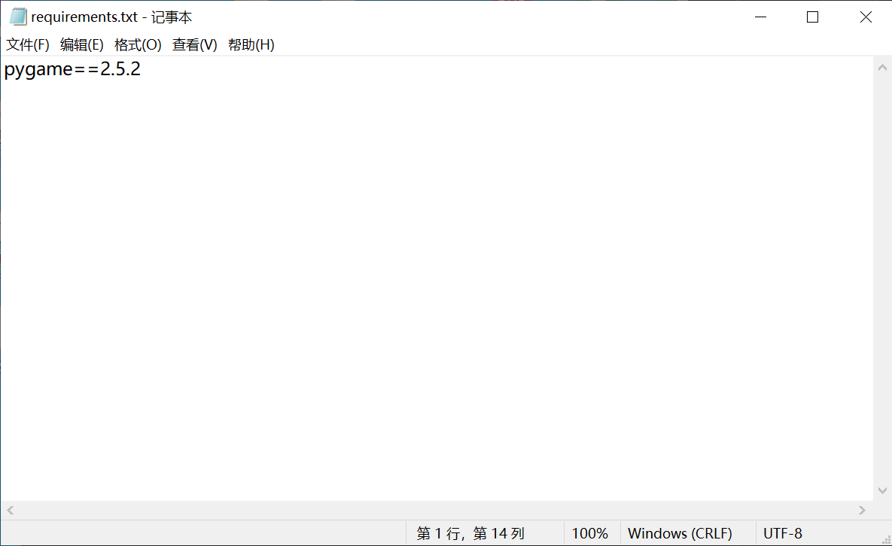
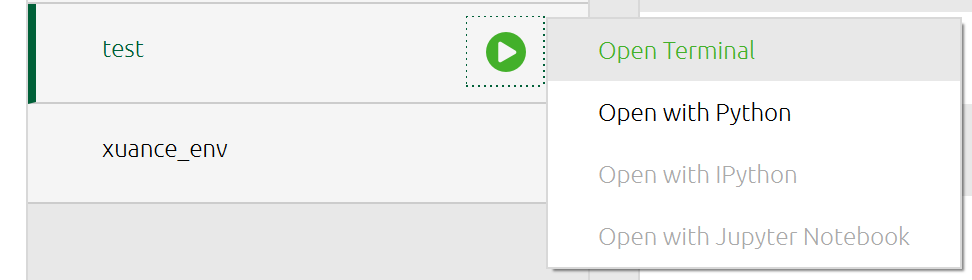
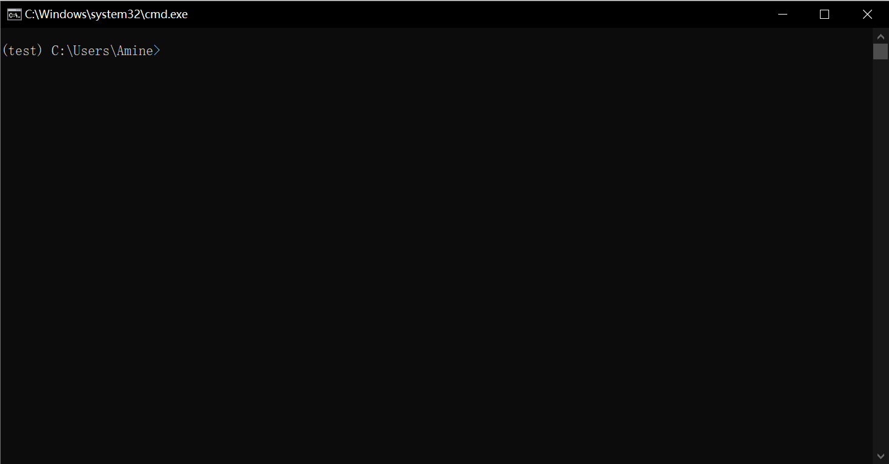
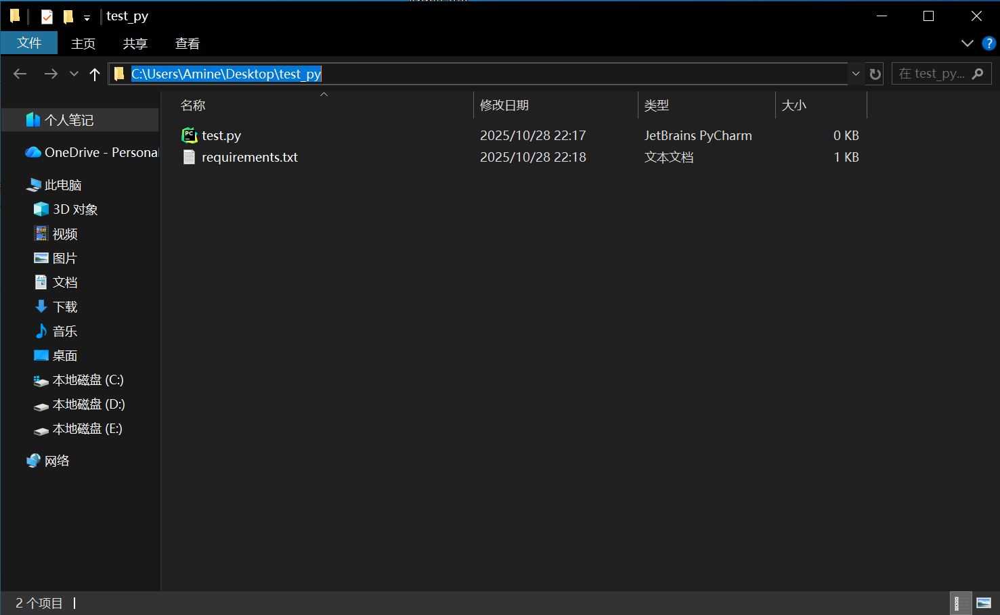
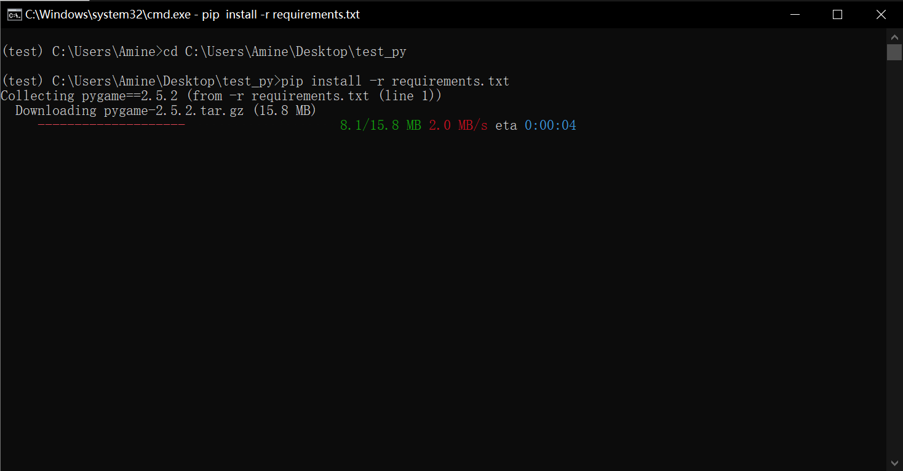
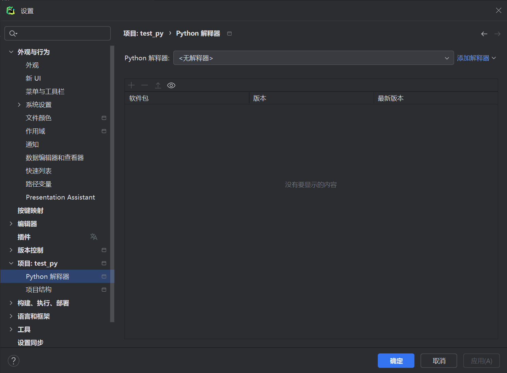
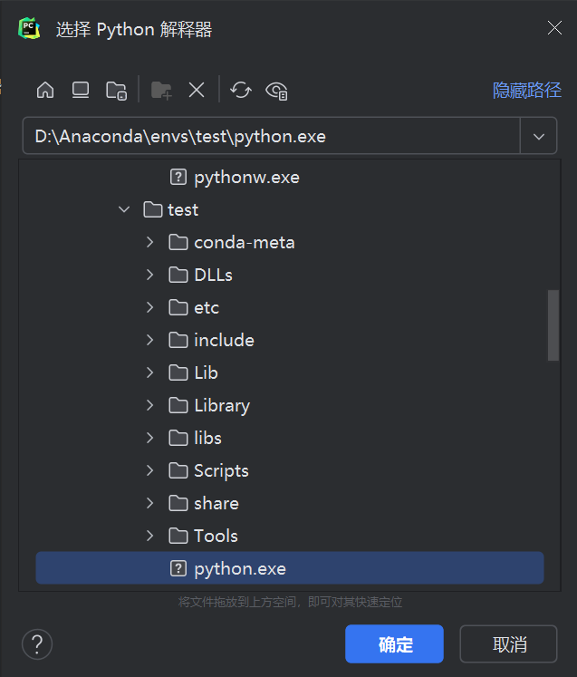

## 如何使用deepseek联合anaconda帮Pycharm快速装配环境

#### 以下以deepseek生成的随机迷宫生成与求解为例子

**下面是一个使用Pygame创建随机迷宫生成和可视化求解的程序。这个程序会生成随机迷宫，然后用深度优先搜索算法找到从起点到终点的路径。**

```python
import pygame
import random
import time
import sys

# 初始化pygame
pygame.init()

# 常量定义
WIDTH, HEIGHT = 800, 600
CELL_SIZE = 20
ROWS, COLS = HEIGHT // CELL_SIZE, WIDTH // CELL_SIZE
FPS = 60

# 颜色定义
BLACK = (0, 0, 0)
WHITE = (255, 255, 255)
RED = (255, 0, 0)
GREEN = (0, 255, 0)
BLUE = (0, 0, 255)
PURPLE = (128, 0, 128)

# 创建屏幕
screen = pygame.display.set_mode((WIDTH, HEIGHT))
pygame.display.set_caption("随机迷宫生成与求解")
clock = pygame.time.Clock()

class Cell:
    def __init__(self, row, col):
        self.row = row
        self.col = col
        self.walls = {'top': True, 'right': True, 'bottom': True, 'left': True}
        self.visited = False
    
    def draw(self):
        x = self.col * CELL_SIZE
        y = self.row * CELL_SIZE
        
        if self.visited:
            pygame.draw.rect(screen, WHITE, (x, y, CELL_SIZE, CELL_SIZE))
        
        if self.walls['top']:
            pygame.draw.line(screen, BLACK, (x, y), (x + CELL_SIZE, y), 2)
        if self.walls['right']:
            pygame.draw.line(screen, BLACK, (x + CELL_SIZE, y), (x + CELL_SIZE, y + CELL_SIZE), 2)
        if self.walls['bottom']:
            pygame.draw.line(screen, BLACK, (x, y + CELL_SIZE), (x + CELL_SIZE, y + CELL_SIZE), 2)
        if self.walls['left']:
            pygame.draw.line(screen, BLACK, (x, y), (x, y + CELL_SIZE), 2)
    
    def get_neighbors(self, grid):
        neighbors = []
        
        # 上
        if self.row > 0 and not grid[self.row - 1][self.col].visited:
            neighbors.append(grid[self.row - 1][self.col])
        # 右
        if self.col < COLS - 1 and not grid[self.row][self.col + 1].visited:
            neighbors.append(grid[self.row][self.col + 1])
        # 下
        if self.row < ROWS - 1 and not grid[self.row + 1][self.col].visited:
            neighbors.append(grid[self.row + 1][self.col])
        # 左
        if self.col > 0 and not grid[self.row][self.col - 1].visited:
            neighbors.append(grid[self.row][self.col - 1])
            
        return neighbors

def remove_walls(current, next_cell):
    # 移除当前单元格和下一个单元格之间的墙
    dx = current.col - next_cell.col
    dy = current.row - next_cell.row
    
    if dx == 1:  # 下一个在左边
        current.walls['left'] = False
        next_cell.walls['right'] = False
    elif dx == -1:  # 下一个在右边
        current.walls['right'] = False
        next_cell.walls['left'] = False
    elif dy == 1:  # 下一个在上边
        current.walls['top'] = False
        next_cell.walls['bottom'] = False
    elif dy == -1:  # 下一个在下边
        current.walls['bottom'] = False
        next_cell.walls['top'] = False

def generate_maze():
    # 创建网格
    grid = [[Cell(row, col) for col in range(COLS)] for row in range(ROWS)]
    
    # 从随机单元格开始
    current = grid[random.randint(0, ROWS-1)][random.randint(0, COLS-1)]
    current.visited = True
    stack = [current]
    
    # 生成迷宫
    while stack:
        for event in pygame.event.get():
            if event.type == pygame.QUIT:
                pygame.quit()
                sys.exit()
        
        screen.fill(WHITE)
        
        # 绘制所有单元格
        for row in grid:
            for cell in row:
                cell.draw()
        
        # 绘制当前单元格
        pygame.draw.rect(screen, RED, 
                        (current.col * CELL_SIZE, current.row * CELL_SIZE, 
                         CELL_SIZE, CELL_SIZE))
        
        pygame.display.flip()
        clock.tick(FPS)
        
        # 获取未访问的邻居
        neighbors = current.get_neighbors(grid)
        
        if neighbors:
            # 随机选择一个邻居
            next_cell = random.choice(neighbors)
            next_cell.visited = True
            
            # 移除墙壁
            remove_walls(current, next_cell)
            
            # 将当前单元格推入堆栈
            stack.append(current)
            
            # 将下一个单元格设为当前单元格
            current = next_cell
        elif stack:
            # 回溯
            current = stack.pop()
    
    return grid

def solve_maze(grid):
    # 使用深度优先搜索解决迷宫
    start = grid[0][0]
    end = grid[ROWS-1][COLS-1]
    
    stack = [start]
    visited = set()
    visited.add((start.row, start.col))
    path = []
    
    while stack:
        for event in pygame.event.get():
            if event.type == pygame.QUIT:
                pygame.quit()
                sys.exit()
        
        current = stack[-1]
        
        # 如果到达终点
        if current == end:
            break
        
        # 查找可移动的邻居
        neighbors = []
        # 上
        if current.row > 0 and not current.walls['top']:
            neighbor = grid[current.row - 1][current.col]
            if (neighbor.row, neighbor.col) not in visited:
                neighbors.append(neighbor)
        # 右
        if current.col < COLS - 1 and not current.walls['right']:
            neighbor = grid[current.row][current.col + 1]
            if (neighbor.row, neighbor.col) not in visited:
                neighbors.append(neighbor)
        # 下
        if current.row < ROWS - 1 and not current.walls['bottom']:
            neighbor = grid[current.row + 1][current.col]
            if (neighbor.row, neighbor.col) not in visited:
                neighbors.append(neighbor)
        # 左
        if current.col > 0 and not current.walls['left']:
            neighbor = grid[current.row][current.col - 1]
            if (neighbor.row, neighbor.col) not in visited:
                neighbors.append(neighbor)
        
        if neighbors:
            # 选择第一个邻居
            next_cell = neighbors[0]
            visited.add((next_cell.row, next_cell.col))
            stack.append(next_cell)
            
            # 绘制路径
            screen.fill(WHITE)
            for row in grid:
                for cell in row:
                    cell.draw()
            
            # 绘制路径
            for i, cell in enumerate(stack):
                color = (0, int(255 * i / len(stack)), 255)
                pygame.draw.rect(screen, color, 
                                (cell.col * CELL_SIZE, cell.row * CELL_SIZE, 
                                 CELL_SIZE, CELL_SIZE))
            
            pygame.display.flip()
            clock.tick(10)  # 减慢求解速度以便观察
        else:
            # 回溯
            stack.pop()
    
    return stack

def main():
    # 生成迷宫
    grid = generate_maze()
    
    # 等待用户按键开始求解
    waiting = True
    while waiting:
        for event in pygame.event.get():
            if event.type == pygame.QUIT:
                pygame.quit()
                sys.exit()
            if event.type == pygame.KEYDOWN:
                if event.key == pygame.K_SPACE:
                    waiting = False
    
    # 解决迷宫
    path = solve_maze(grid)
    
    # 显示最终路径
    screen.fill(WHITE)
    for row in grid:
        for cell in row:
            cell.draw()
    
    for cell in path:
        pygame.draw.rect(screen, GREEN, 
                        (cell.col * CELL_SIZE, cell.row * CELL_SIZE, 
                         CELL_SIZE, CELL_SIZE))
    
    # 标记起点和终点
    pygame.draw.rect(screen, BLUE, 
                    (0, 0, CELL_SIZE, CELL_SIZE))
    pygame.draw.rect(screen, PURPLE, 
                    ((COLS-1) * CELL_SIZE, (ROWS-1) * CELL_SIZE, 
                     CELL_SIZE, CELL_SIZE))
    
    pygame.display.flip()
    
    # 等待用户关闭窗口
    running = True
    while running:
        for event in pygame.event.get():
            if event.type == pygame.QUIT:
                running = False
    
    pygame.quit()

if __name__ == "__main__":
    main()
```


### 1.利用deepseek为上述代码生成对应的requirements.txt文件

##### 为上述代码生成 `requirements.txt` 文件，内容如下：

```bash
pygame==2.5.2
```

讲上如内容保存至requirements.txt文件中，如下所示：




### 2.利用anaconda配置对应环境

#### **1.打开Anaconda创建对应的环境名称**

_（注：此处原有微信图片，请手动添加 Anaconda 创建环境的截图）_

#### **2.环境名称安装完成后对环境进行配置**

**点击Open Terminal**






**回退到你所保存requirements.txt文件所在的文件夹，如图所示，该文件所在地址为：C:\Users\Amine\Desktop\test_py**



**在terminal中输入cd C:\Users\Amine\Desktop\test_py**

**再次输入pip install -r requirements.txt就开始配置环境啦**




### 3.在pycharm中寻找对应的环境配置器

#### 1.点击files-settings-projects-pycharm解释器



#### 2.点击添加解释器-添加本地解释器-现有-...(框框后的省略号)，再去查找你所配置的环境的位置即可




